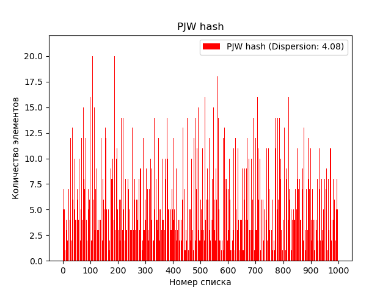
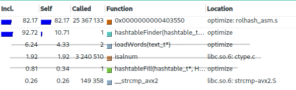

# Хеш-таблица. Исследование возможностей оптимизации поиска по   хеш-таблице

## Цель работы
Изучить возможности оптимизации хеш-функций и инфраструктуры хеш-таблиц с целью повышения их скорости работы. Провести анализ по поводу необходимости тех или иных оптимизаций, дать им оценку.

## Инструменты
Инструмент callgrind, утилиты valgrind, инструмент визуализации kcachegring, роман Ч. Паланика "Fight club".

## Экспериментальная установка

Ноутбук Honor Magicbook 15 на процессоре Intel Core i5-10210U, любезно предоставленный мне для работы сообществом [Физтех-Союз](https://phystech-union.org/phystech-alpha/)
## Теоретическая часть

Хеш-таблица - это структура данных, которая используется для хранения и поиска пар ключ-значение. Ключ - это уникальный идентификатор, который используется для получения значения из таблицы. Хеш-функция - это функция, которая преобразует ключ в индекс, по которому значение будет храниться в таблице.

Метод цепочек - это один из способов разрешения коллизий в хеш-таблице, когда разные ключи хешируются в один и тот же индекс. При использовании этого метода, каждый элемент хранится в виде связанного списка, где все элементы, которые хешируются в один индекс, хранятся в одном списке.


Коллизия - это ситуация, когда разные ключи хешируются в один и тот же индекс в хеш-таблице. Коллизии могут приводить к увеличению времени поиска элементов в таблице, так как необходимо производить дополнительные операции для поиска нужного элемента.

Заселенность - это средняя длина цепочки элементов в хеш-таблице. Заселенность показывает, насколько заполнена таблица, и она может влиять на производительность операций поиска и добавления элементов. При слишком высокой заселенности возрастает вероятность коллизий, что может привести к увеличению времени поиска и добавления элементов. 


## Часть 1. Работа с хеш-функциями

Прежде чем начать работу над оптимизацией необходимо выбрать подходящую хеш-функцию. Нет смысла пытаться оптимизировать работу с хеш-таблицей, основанной на хеш-функции, дисперсия распределения которой очень велика. Поэтому решено рассмотреть 7 различных хеш-функций, проанализировать их дисперсии распределния после загрузки базы данных и выбрать одну функцию для дальнейшей оптимизации. 

Измерения на проводятся на базе данных (роман "Fight Club") из 50000 слов и хеш-таблице ёмкостью 2000 элементов, чтобы заселённость была равна примерно 10-20 элементов. 

Итак, рассмотрим хеш-функции и графики их распределения с рассчитанной дисперсией.

--------------------------------------------------------
### **1. Const hash**
Возвращает 1 независимо от входных данных.
```C++
static unsigned int constHash(const char* str)
{
    return 1;
}
```
<details>
<summary> Распределение хеш-функции </summary>


* **Примечание:** Максимальное значение на горизонтальной оси равно 500, а не 1000, потому что при использовании этой хэш-функции в хэш-таблицe использовался лишь один элемент из 1000. 
</details>

--------------------------------------------------------
### **2. First ASCII hash**
Возвращает ASCII-код первого символа строки.
```C++
static unsigned int firstAscii(const char* str)
{
    return (unsigned int) str[0];
}
```
<details>
<summary> Распределение хеш-функции </summary>


</details>

--------------------------------------------------------
### **3. Wordlen hash**
Возвращает длину строки.
```C++
static unsigned int wordLen(const char* str)
{
    return strlen(str);
}
```
<details>
<summary> Распределение хеш-функции </summary>


</details>

--------------------------------------------------------
### **4. ASCII sum hash**
Возвращает сумму ASCII-кодов всех символов строки.
```C++
static unsigned int sumAscii(const char* str)
{
    unsigned int ascii_sum = 0;
    size_t       index     = 0;

    while (*(str + index))
    {
        ascii_sum += *((str + index++));
    }

    return ascii_sum;
}
```
<details>
<summary> Распределение хеш-функции </summary>


</details>

--------------------------------------------------------
### **5. ROL hash**

Выполняет циклический сдвиг хеша влево (`my_rol`) и `XOR` со значением элемента строки
```C++
static unsigned int rolHash(const char* str)
{
    unsigned int hash  = 0;
    size_t       index = 0;

    while (*(str + index))
    {
        hash = my_rol(hash, 1) ^ str[index++];
    }

    return hash;
}
```
<details>
<summary> Распределение хеш-функции </summary>


</details>

--------------------------------------------------------
### **6. ROR hash**

Выполняет циклический сдвиг хеша вправо (`my_ror`) и `XOR` со значением элемента строки
```C++
static unsigned int rorHash(const char* str)
{
    unsigned int hash  = 0;
    size_t       index = 0;

    while (*(str + index))
    {
        hash = my_ror(hash, 1) ^ str[index++];
    }

    return hash;
}
```
<details>
<summary> Распределение хеш-функции </summary>


</details>


--------------------------------------------------------
### **7. PJW hash**
PJW-32 (hashpjw) — хеш-функция, разработанная Питером Вэйнбергером (Peter J. Weinberger) из AT&T Bell Laboratories.
Для произвольного входного сообщения функция генерирует 32-разрядное хеш-значение, называемое хеш-суммой сообщения.
```C++
static unsigned int pjwHash(const char* str)
{
    unsigned int hash = 0;
    unsigned int test = 0;

    size_t index = 0;
    while(*(str+index))
    {
        hash = (hash << 4) + (unsigned char) (*(str + index++));
    
        if ((test = hash & 0xF0000000) != 0)
            hash = ((hash ^ (test >> 24)) & (0xFFFFFFFF));
    }

    return hash;
}
```
<details>
<summary> Распределение хеш-функции </summary>


</details>

--------------------------------------------------------
### **Анализ проведенной работы. Итог первой части**

Вынесем отдельно 3 функции, показавшие лучшие результат.

| Хеш-функция      | Дисперсия |
| -----------------| --------- |
| ROL hash         | 3.06      |
| PJW hash         | 4.08 |
| ASCII sum hash   |   6.41    |

ROL хеш-функция продемонстрировала наилучший результат, имея наименьшую дисперсию распределения по хеш-таблице. Решено касательно выбора хеш-функции остановиться на ней и переходить ко второй части.

## Часть 2. Оптимизация поиска по хеш-таблице

В данном разделе проекта рассматривается вопрос оптимизации поиска по хеш-таблице. Для измерения производительности функции поиска было проведено замерение машинного времени ее работы. Кроме того, для более детального анализа производительности были использованы инструменты callgrind и kcachegrind.

Callgrind - это профилировщик производительности, который позволяет анализировать производительность программы путем сбора данных о том, сколько раз вызываются функции и сколько времени занимает выполнение каждой из них.

Kcachegrind - это графический интерфейс для анализа данных, собранных при помощи callgrind. Kcachegrind позволяет визуализировать данные о производительности программы и проанализировать ее работу на каждом этапе выполнения.

Далее будут описаны примененные методы оптимизации, результаты их использования и сравнение производительности с базовой реализацией (абсолютное ускорение) и с предыдущим шагом оптимизации (относительное ускорение). Для каждого шага оптимизации будет прикреплен скриншот из kcachegrind, что позволит наглядно продемонстрировать изменения производительности программы и эффективность примененных методов оптимизации.

--------------------------------------------------------

### **Шаг 0. Базовая реализация (далее: base)**

Проведем измерения неоптимизированной версии:

| Оптимизация  |  Время выполнения, c  | Абсолютное ускорение | Относительное ускорение |
| :----------: | :-------------------: | :------------------: | :---------------------: |
| base         |   0.002115            |   1                  | 1                       |

По скриншоту из программы kcachegrind видно, что в первую очередь для улучшения производительности нужно оптимизировать функцию `findinTable`(см. Примечание), проверяющую наличие строки в хеш-таблице. 


<details>
<summary> Примечание </summary>
Здесь и в последующих шагах я буду объяснять, почему игнорируются те или иные функции, расположенные в списке выше тех, которые мы собираемся оптимизировать.

Функция `matchWords` никак не участвует в процессе поиска по хеш-таблице. Её задача - считывать данные из входного файла для заполнения самой хеш-таблицы.

</details>


--------------------------------------------------------

### Шаг 1. Флаги оптимизации (далее: -O3)

В прошлых двух проектах - [Mandelbrot set](https://github.com/mr-gukas/MyMandelbrot) и [Alpha Blending](https://github.com/mr-gukas/MyALphaBlending) - мы уже убедились в необходимости использования флагов оптимизации в целях увеличения производительности программы. (В вышеупомнятух работах даже подчеркивается роль данных флагов при использовании SIMD инструкций). Поэтому очевидно верным решением будет использовать подобные флаги и в данной работе, а именно: будет использован флаг `-O3`


Проведем измерения данной версии:

| Оптимизация  |  Время выполнения, c  | Абсолютное ускорение | Относительное ускорение |
| :----------: | :-------------------: | :------------------: | :---------------------: |
| base         |   0.002115            |   1                  | 1                       |
| -O3          |   0.000333            |   6,4                | 6,4                     |

Как видно, вперед вышли функции вычисления хеша `rolHash` и сравнение строк `_strcmp_avx2`. Будем работать над их оптимизацией.


<details>
<summary> Примечание </summary>

Функции `isalnum` и `hashtableFill` никак не участвует в процессе поиска по хеш-таблице, они участвуют лишь в процессе заполнения самой хеш-таблицы.

</details>

0.000206

--------------------------------------------------------

### Шаг 2. Оптимизация хеш-функции (далее: opt.1)

На данном этапе применяемым мной методом оптимизации является замена хэш-функции, написанной на языке C, на ее реализацию на языке ассемблера. Данная оптимизация действительно может улучшить производительность программы, так как ассемблерные инструкции могут быть более эффективными по сравнению с эквивалентными инструкциями на языке C. Это связано с тем, что компиляторы не всегда могут генерировать оптимальный код, и в случае использования ассемблерных инструкций, программист имеет больший контроль над тем, как именно будет выполнена каждая операция.

Проведем измерения данной версии:

| Оптимизация  |  Время выполнения, c  | Абсолютное ускорение | Относительное ускорение |
| :----------: | :-------------------: | :------------------: | :---------------------: |
| base         |   0.002115            |   1                  | 1                       |
| -O3          |   0.000333            |   6,4                | 6,4                     |
| opt.1        |   0.000206            |   10.3               | 1,6                     |

Как можно заметить, эта оптимизация принесла нам хорошее увеличение производительности, хотя, конечно, и пришлось увеличить число строчек кода, написанных на ассемблере.
Однако полученное ускорение, на мой взгляд, оправдывает приложенные усилия, и мы можем двигаться дальше. 
Видно, что всё еще местами, которые стоит оптимизировать, являются функции вычисления хеша и сравнения строк. Рассмотрим последнюю подбробнее в следующем шаге. 




