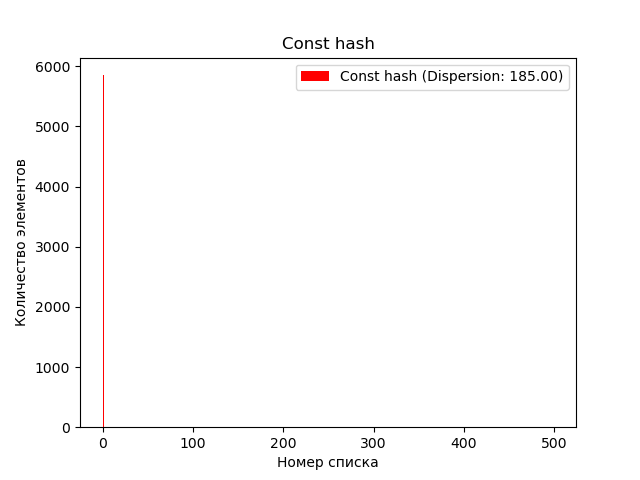
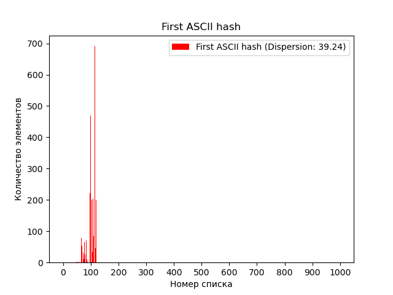
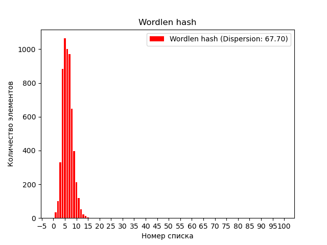
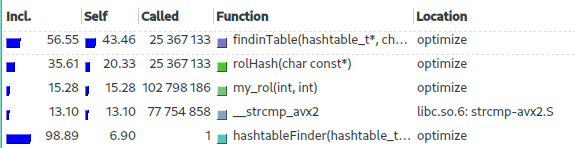

# Хеш-таблица. Исследование возможностей оптимизации поиска по   хеш-таблице

## Цель работы
Изучить возможности оптимизации хеш-функций и инфраструктуры хеш-таблиц с целью повышения их скорости работы. Провести анализ по поводу необходимости тех или иных оптимизаций, дать им оценку.

## Инструменты
Инструмент callgrind, утилиты valgrind, инструмент визуализации kcachegring, роман Ч. Паланика "Fight club".

## Экспериментальная установка

Ноутбук Honor Magicbook 15 на процессоре Intel Core i5-10210U, любезно предоставленный мне для работы сообществом [Физтех-Союз](https://phystech-union.org/phystech-alpha/)
## Теоретическая часть

Хеш-таблица - это структура данных, которая используется для хранения и поиска пар ключ-значение. Ключ - это уникальный идентификатор, который используется для получения значения из таблицы. Хеш-функция - это функция, которая преобразует ключ в индекс, по которому значение будет храниться в таблице.

Метод цепочек - это один из способов разрешения коллизий в хеш-таблице, когда разные ключи хешируются в один и тот же индекс. При использовании этого метода, каждый элемент хранится в виде связанного списка, где все элементы, которые хешируются в один индекс, хранятся в одном списке.


Коллизия - это ситуация, когда разные ключи хешируются в один и тот же индекс в хеш-таблице. Коллизии могут приводить к увеличению времени поиска элементов в таблице, так как необходимо производить дополнительные операции для поиска нужного элемента.

Заселенность - это средняя длина цепочки элементов в хеш-таблице. Заселенность показывает, насколько заполнена таблица, и она может влиять на производительность операций поиска и добавления элементов. При слишком высокой заселенности возрастает вероятность коллизий, что может привести к увеличению времени поиска и добавления элементов. 


## Часть 1. Работа с хеш-функциями

Прежде чем начать работу над оптимизацией необходимо выбрать подходящую хеш-функцию. Нет смысла пытаться оптимизировать работу с хеш-таблицей, основанной на хеш-функции, дисперсия распределения которой очень велика. Поэтому решено рассмотреть 7 различных хеш-функций, проанализировать их дисперсии распределния после загрузки базы данных и выбрать одну функцию для дальнейшей оптимизации. 

Измерения на проводятся на базе данных (роман "Fight Club") из 50000 слов и хеш-таблице ёмкостью 2000 элементов, чтобы заселённость была равна примерно 10-20 элементов. 

Итак, рассмотрим хеш-функции и графики их распределения с рассчитанной дисперсией.

--------------------------------------------------------
### **1. Const hash**
Возвращает 1 независимо от входных данных.
```C++
static unsigned int constHash(const char* str)
{
    return 1;
}
```
<details>
<summary> Распределение хеш-функции </summary>



* **Примечание:** Максимальное значение на горизонтальной оси равно 500, а не 1000, потому что при использовании этой хэш-функции в хэш-таблицe использовался лишь один элемент из 1000. 
</details>

--------------------------------------------------------
### **2. First ASCII hash**
Возвращает ASCII-код первого символа строки.
```C++
static unsigned int firstAscii(const char* str)
{
    return (unsigned int) str[0];
}
```
<details>
<summary> Распределение хеш-функции </summary>


</details>

--------------------------------------------------------
### **3. Wordlen hash**
Возвращает длину строки.
```C++
static unsigned int wordLen(const char* str)
{
    return strlen(str);
}
```
<details>
<summary> Распределение хеш-функции </summary>


</details>

--------------------------------------------------------
### **4. ASCII sum hash**
Возвращает сумму ASCII-кодов всех символов строки.

```C++
static unsigned int sumAscii(const char* str)
{
    unsigned int ascii_sum = 0;
    size_t       index     = 0;

    while (*(str + index))
    {
        ascii_sum += *((str + index++));
    }

    return ascii_sum;
}
```
<details>
<summary> Распределение хеш-функции </summary>


</details>

--------------------------------------------------------
### **5. ROL hash**

Выполняет циклический сдвиг хеша влево (`my_rol`) и `XOR` со значением элемента строки
```C++
static unsigned int rolHash(const char* str)
{
    unsigned int hash  = 0;
    size_t       index = 0;

    while (*(str + index))
    {
        hash = my_rol(hash, 1) ^ str[index++];
    }

    return hash;
}
```
<details>
<summary> Распределение хеш-функции </summary>


</details>

--------------------------------------------------------
### **6. ROR hash**

Выполняет циклический сдвиг хеша вправо (`my_ror`) и `XOR` со значением элемента строки
```C++
static unsigned int rorHash(const char* str)
{
    unsigned int hash  = 0;
    size_t       index = 0;

    while (*(str + index))
    {
        hash = my_ror(hash, 1) ^ str[index++];
    }

    return hash;
}
```
<details>
<summary> Распределение хеш-функции </summary>


</details>


--------------------------------------------------------
### **7. PJW hash**
PJW-32 (hashpjw) — хеш-функция, разработанная Питером Вэйнбергером (Peter J. Weinberger) из AT&T Bell Laboratories.
Для произвольного входного сообщения функция генерирует 32-разрядное хеш-значение, называемое хеш-суммой сообщения.
```C++
static unsigned int pjwHash(const char* str)
{
    unsigned int hash = 0;
    unsigned int test = 0;

    size_t index = 0;
    while(*(str+index))
    {
        hash = (hash << 4) + (unsigned char) (*(str + index++));
    
        if ((test = hash & 0xF0000000) != 0)
            hash = ((hash ^ (test >> 24)) & (0xFFFFFFFF));
    }

    return hash;
}
```
<details>
<summary> Распределение хеш-функции </summary>


</details>

--------------------------------------------------------
### **Анализ проведенной работы. Итог первой части**

Вынесем отдельно 3 функции, показавшие лучшие результат.

| Хеш-функция      | Дисперсия |
| -----------------| --------- |
| ROL hash         | 3.06      |
| PJW hash         | 4.08 |
| ASCII sum hash   |   6.41    |

ROL хеш-функция продемонстрировала наилучший результат, имея наименьшую дисперсию распределения по хеш-таблице. Решено касательно выбора хеш-функции остановиться на ней и переходить ко второй части.

## Часть 2. Оптимизация поиска по хеш-таблице

В данном разделе проекта рассматривается вопрос оптимизации поиска по хеш-таблице. Для измерения производительности функции поиска было проведено замерение машинного времени ее работы. Кроме того, для более детального анализа производительности были использованы инструменты callgrind и kcachegrind.

Callgrind - это профилировщик производительности, который позволяет анализировать производительность программы путем сбора данных о том, сколько раз вызываются функции и сколько времени занимает выполнение каждой из них.

Kcachegrind - это графический интерфейс для анализа данных, собранных при помощи callgrind. Kcachegrind позволяет визуализировать данные о производительности программы и проанализировать ее работу на каждом этапе выполнения.

Далее будут описаны примененные методы оптимизации, результаты их использования и сравнение производительности с базовой реализацией (абсолютное ускорение) и с предыдущим шагом оптимизации (относительное ускорение). Для каждого шага оптимизации будет прикреплен скриншот из kcachegrind, что позволит наглядно продемонстрировать изменения производительности программы и эффективность примененных методов оптимизации. Время выполнения - математическое ожидание времени  выполнения функции поиска по хеш-таблице, вычисленное за 10000 запусков программы.

--------------------------------------------------------

### **Шаг 0. Базовая реализация (далее: base)**

Проведем измерения неоптимизированной версии:

| Оптимизация  |  Время выполнения, c  | Абсолютное ускорение | Относительное ускорение |
| :----------: | :-------------------: | :------------------: | :---------------------: |
| base         |   0.002115            |   1                  | 1                       |

По скриншоту из программы kcachegrind видно, что в первую очередь для улучшения производительности нужно оптимизировать функцию `findinTable`(см. Примечание), проверяющую наличие строки в хеш-таблице. 



<details>
<summary> Примечание </summary>
Здесь и в последующих шагах я буду объяснять, почему игнорируются те или иные функции, расположенные в списке выше тех, которые мы собираемся оптимизировать.

Функция `matchWords` никак не участвует в процессе поиска по хеш-таблице. Её задача - считывать данные из входного файла для заполнения самой хеш-таблицы.

</details>


--------------------------------------------------------

### Шаг 1. Флаги оптимизации (далее: -O3)

В прошлых двух проектах - [Mandelbrot set](https://github.com/mr-gukas/MyMandelbrot) и [Alpha Blending](https://github.com/mr-gukas/MyALphaBlending) - мы уже убедились в необходимости использования флагов оптимизации в целях увеличения производительности программы. (В вышеупомнятух работах даже подчеркивается роль данных флагов при использовании SIMD инструкций). Поэтому очевидно верным решением будет использовать подобные флаги и в данной работе, а именно: будет использован флаг `-O3`


Проведем измерения данной версии:

| Оптимизация  |  Время выполнения, c  | Абсолютное ускорение | Относительное ускорение |
| :----------: | :-------------------: | :------------------: | :---------------------: |
| base         |   0.002115            |   1                  | 1                       |
| -O3          |   0.000333            |   6.4                | 6.4                     |

Как видно, вперед вышли функции вычисления хеша `rolHash` и сравнение строк `_strcmp_avx2`. Будем работать над их оптимизацией.


<details>
<summary> Примечание </summary>

Функции `isalnum` и `hashtableFill` никак не участвует в процессе поиска по хеш-таблице, они участвуют лишь в процессе заполнения самой хеш-таблицы.

</details>

--------------------------------------------------------

### Шаг 2. Оптимизация хеш-функции (далее: opt.1)

На данном этапе применяемым мной методом оптимизации является замена хэш-функции, написанной на языке C, на ее реализацию на языке ассемблера. Данная оптимизация действительно может улучшить производительность программы, так как ассемблерные инструкции могут быть более эффективными по сравнению с эквивалентными инструкциями на языке C. Это связано с тем, что компиляторы не всегда могут генерировать оптимальный код, и в случае использования ассемблерных инструкций, программист имеет больший контроль над тем, как именно будет выполнена каждая операция.

<details>
<summary> Реализация хеш-функции </summary>

```ASM
section .text
global rolHash_asm

rolHash_asm:
    push rbx 
    push rcx

    xor     eax, eax        ; Обнуляем eax (регистр для хеша)
    xor     ecx, ecx        ; Обнуляем ecx (регистр для индекса)
.loop:
    mov     bl, byte [rdi + rcx]    ; Загружаем очередной байт строки в bl
    test    bl, bl                  ; Проверяем, не кончилась ли строка
    jz      .end_loop               ; Если кончилась, выходим из цикла
    rol     eax, 1                  ; Сдвигаем хеш влево на 1 бит
    xor     al, bl                  ; XOR-им байт строки с младшим байтом хеша
    inc     ecx                     ; Увеличиваем индекс
    jmp     .loop                   ; Переходим на следующую итерацию цикла
.end_loop:
    pop rcx 
    pop rbx
    ret                             ; Возвращаем результат в eax
```
</details>


Проведем измерения данной версии:

| Оптимизация  |  Время выполнения, c  | Абсолютное ускорение | Относительное ускорение |
| :----------: | :-------------------: | :------------------: | :---------------------: |
| base         |   0.002115            |   1                  | 1                       |
| -O3          |   0.000333            |   6.4                | 6.4                     |
| opt.1        |   0.000224            |   9.4                | 1.5                     |

Как можно заметить, эта оптимизация принесла нам хорошее увеличение производительности, хотя, конечно, и пришлось увеличить число строчек кода, написанных на ассемблере.
Однако полученное ускорение, на мой взгляд, оправдывает приложенные усилия, и мы можем двигаться дальше. 
Видно, что всё еще местами, которые стоит оптимизировать, являются функции вычисления хеша и сравнения строк. Рассмотрим последнюю подбробнее в следующем шаге. 


--------------------------------------------------------

### Шаг 3. Оптимизация strcmp(далее: opt.2)

На данном этапе попытаемся ускорить процесс сравнения строк написанием собственной реализации функции `strcmp` в виде ассемблерной вставки.

<details>
<summary> Реализация ассемблерной вставки</summary>

```C++
int asm_strcmp(const char* str1, const char* str2) 
{
    int res = 0;
    asm volatile (
        ".intel_syntax noprefix;"
        "1: "
        "lodsb;"
        "scasb;"
        "jne 2f;"
        "test al, al;"
        "jne 1b;"
        "xor eax, eax;"
        "jmp 3f;"
        "2: "
        "dec edi;"
        "sbb eax, eax;"
        "3: "
        ".att_syntax" 
        : "=a" (res)
        : "S" (str1), "D" (str2)
        : "memory"
    );
    return res;
}
```
</details>


Проведем измерения данной версии:

| Оптимизация  |  Время выполнения, c  | Абсолютное ускорение | Относительное ускорение |
| :----------: | :-------------------: | :------------------: | :---------------------: |
| base         |   0.002115            |   1                  | 1                       |
| -O3          |   0.000333            |   6.4                | 6.4                     |
| opt.1        |   0.000224            |   9.4                | 1.5                     |
| opt.2        |   0.000387            |   5.5                | 0.6                     |

Как можно заметить, эта оптимизация не принесла ожидаемого увеличения производительности, наоборот, процесс замедлился. Причиной такого поведения может быть недостаточно оптимизированный код (в отличие от оптимизированных библиотечных функций). Мы вынуждены отказаться от данного шага оптимизации и в следующем шаге постараемся учесть ошибки.


--------------------------------------------------------
### Шаг 4. Оптимизация strcmp. Попытка вторая(далее: opt.3)

В процессе оптимизации программы, решено заменить использование встроенной функции strcmp на собственную ее реализацию с использованием AVX2 инструкций, потому что инструкции AVX2 могут обеспечить более быструю обработку данных, чем обычные инструкции процессора.

Однако, перед тем, как начать использовать эти инструкции, нам нужно было дополнительно обработать входные данные. Мы решили дополнить каждое слово до 32 символов, чтобы получить 32-байтовое выравнивание. Это сделано для того, чтобы обеспечить наилучшую производительность при использовании инструкций AVX2, которые требуют 32-байтового выравнивания данных. Если данные не выровнены, то процессор должен выполнить дополнительные операции для чтения/записи данных, что может замедлить программу. 

<details>
<summary> Реализация strcmp с использованием avx2</summary>

```C++
int avx2_strcmp(const char* str1, const char* str2)
{
    __m256i a = _mm256_load_si256((__m256i*)str1);
    __m256i b = _mm256_load_si256((__m256i*)str2);
    __m256i cmp = _mm256_cmpeq_epi8(a, b);

    int mask = _mm256_movemask_epi8(cmp);
    if (mask == 0xffffffff) 
    {
        return 0;
    }
    else
    {
        int offset = __builtin_ctz(~mask);
        return (unsigned char)str1[offset] - (unsigned char)str2[offset];
    }
}
```
</details>


Проведем измерения данной версии:

| Оптимизация  |  Время выполнения, c  | Абсолютное ускорение | Относительное ускорение |
| :----------: | :-------------------: | :------------------: | :---------------------: |
| base         |   0.002115            |   1                  | 1                       |
| -O3          |   0.000333            |   6.4                | 6.4                     |
| opt.1        |   0.000224            |   9.4                | 1.5                     |
| opt.3        |   0.000213            |   9.9                | 1.1                     |

Как можно заметить, эта оптимизация принесла увеличение производительности. Однако функция хеширования всё еще оказывает сильное влияение на производительность, поэтому попробуем исправить это в следующем шаге.


--------------------------------------------------------
### Шаг 5. Хеширование с использованием криптографических функций AVX2 (далее: opt.4)

Хеш-функция CRC32 (Cyclic Redundancy Check 32-bit) используется для вычисления контрольной суммы данных, которая может использоваться для обнаружения ошибок при передаче данных. Она основывается на делении числа, представляющего данные, на заданный полином, и взятии остатка от этого деления.

Одним из преимуществ хеш-функции CRC32 является ее быстродействие. Кроме того, она имеет свойство распределения, что значит, что небольшие изменения во входных данных приводят к большим изменениям в выходных данных. Это делает ее хорошим выбором для задач хеширования данных.

Функция _mm_crc32_u32 - это встроенная функция, которая выполняет вычисление контрольной суммы с использованием инструкции CRC32 в наборе инструкций AVX2. Она позволяет эффективно вычислять контрольную сумму на основе хеш-функции CRC32 для больших объемов данных. Функция _mm_crc32_u32 быстрее и эффективнее, так как она использует оптимизированный аппаратный код, специально предназначенный для работы с контрольными суммами, а также множество других оптимизаций, например, распараллеливание вычислений.

<details>
<summary> Реализация хеш-функции с использованием avx2</summary>

```C++
unsigned int avx_crc32(const char* str)
{
    __m256i data = _mm256_load_si256((__m256i*)str);
    unsigned int hash = _mm_crc32_u32(0, _mm256_extract_epi64(data, 0));
    hash = _mm_crc32_u32(hash, _mm256_extract_epi64(data, 1));
    hash = _mm_crc32_u32(hash, _mm256_extract_epi64(data, 2));
    hash = _mm_crc32_u32(hash, _mm256_extract_epi64(data, 3));
    return hash;
}
```
</details>


Проведем измерения данной версии:

| Оптимизация  |  Время выполнения, c  | Абсолютное ускорение | Относительное ускорение |
| :----------: | :-------------------: | :------------------: | :---------------------: |
| base         |   0.002115            |   1                  | 1                       |
| -O3          |   0.000333            |   6.4                | 6.4                     |
| opt.1        |   0.000224            |   9.4                | 1.5                     |
| opt.3        |   0.000213            |   9.9                | 1.1                     |
| opt.4        |   0.000005            |   423                | 42.6                    |

Как можно заметить, эта оптимизация принесла колоссальное увеличение производительности. Однако, не стоит забывать, что чем большее ассемблерных оптимизаций мы используем, тем меньше переносимость и читаемость нашей программы. 


--------------------------------------------------------
## Итоги

Приведем еще раз таблицу измерений для сравнения:

| Оптимизация  |  Время выполнения, c  | Абсолютное ускорение | Относительное ускорение |
| :----------: | :-------------------: | :------------------: | :---------------------: |
| base         |   0.002115            |   1                  | 1                       |
| -O3          |   0.000333            |   6.4                | 6.4                     |
| opt.1        |   0.000224            |   9.4                | 1.5                     |
| opt.3        |   0.000213            |   9.9                | 1.1                     |
| opt.4        |   0.000005            |   423                | 42.6                    |

В рамках учебного задания были выполнены оптимизации, связанные с использованием ассемблерной вставки, функции, написанной на ассемблере, и avx2 инструкций. Нам удолось серьёзно увеличить производительность работы с хеш-таблицей (дальнейшие попытки оптимизации не принесли бы колоссальных улучшений), однако разменной монетой стало снижение переносимости и читаемости кода. В такой же [работе](https://github.com/KetchuppOfficial/Hash_Table/blob/master/README.md) прошлого года  для определения цены подобных оптимизаций Александр Долгов [(KetchuppOfficial)](https://github.com/KetchuppOfficial) вводит определение Ded_Coefficient:

```
Ded_Coefficient = (acceleration value / number of assembly lines) * 1000
```
В моем случае: Ded_Coefficient = (423 / 33) * 1000 = 12812 

**Выводы**
* Доказали, что в целях увеличения производительности программ недостаточно использование только флагов оптимизации
* При более строгих требованиях к исходным данных и дополнительной обработке можно получить увеличить скорость выполнения программы
* На примере Шага 3 убедились, что не всегда вручную написанный код на ассемблере улучшить быстродействие программы

